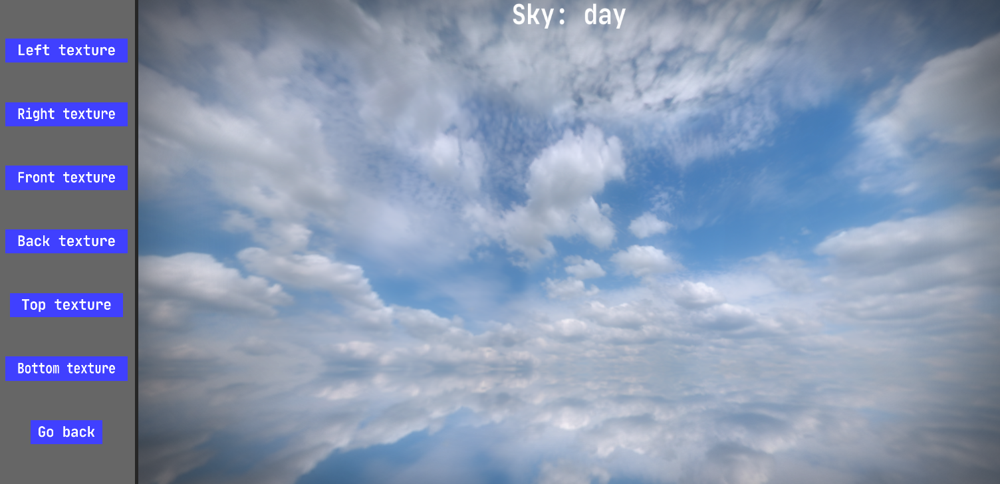
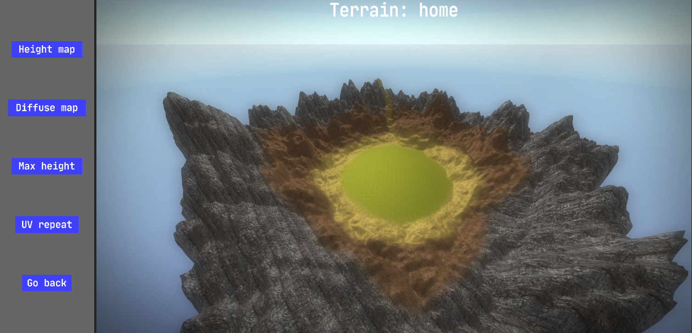
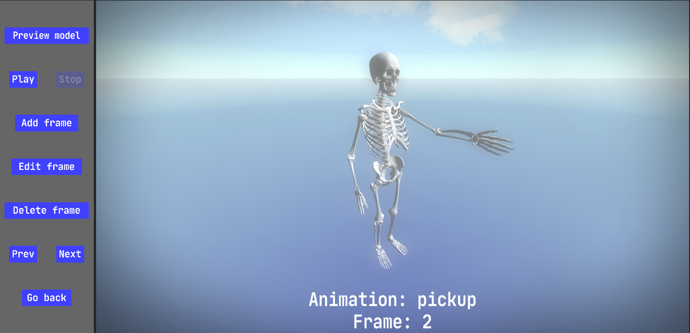
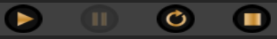

# FabiEngine3D
FabiEngine3D is a small game engine for simple 3D games.  
It contains various features such as: asset loading, 2D & 3D rendering, audio, user input, physics, scripting and an engine GUI to work with.  
The engine only uses 2 libraries: OpenGL 4.5 & SDL2. It is written in C++17 and works only on Windows.

## Table of contents
1. [Features](#features)
2. [Engine interface](#engine-interface)
3. [Folder structures](#folder-structures)
4. [Development order](#development-order)
5. [Project management](#project management)
6. [Environment editor](#environment-editor)
7. [Model editor](#model-editor)
8. [Animation editor](#animation-editor)
9. [Billboard editor](#billboard-editor)
10. [Audio editor](#audio-editor)
11. [Scene editor](#scene-editor)
12. [Script editor](#script-editor)
13. [Project settings](#project-settings)
14. [FabScript](#fabScript)
14. [Game execution](#game-execution)
14. [Miscellaneous](#miscellaneous)
14. [Screenshots](#screenshots)

## Features
### Asset loading
- Multithreaded PNG texture file loading
- Multithreaded OBJ mesh file loading
- Multithreaded WAV audio file loading
- Efficient (pre-)caching system  
### Rendering
- **3D rendering**: sky, terrain, water, model, billboard
- **2D rendering**: image, text
- **Graphics**: ambient lighting, directional lighting, specular reflections, point lights, shadows, sky reflections, realtime scene reflections, fog
- **Textures**: diffuse, cube, normal, reflection, light, height, gui, flare, dudv, displacement, blend, billboard
- **Post processing**: bloom, DOF, motion blur, anti aliasing, sky HDR, lens flare
### Audio
- Custom music playlist
- 2D audio playback
- 3D audio playback (volume distance, stereo panning)
### Input
- Keyboard input
- Mouse input
- Controller input
### Physics
- AABB system
- Collision detection
- Collision response
- Raycasting system
- 3D camera system
- Custom math library
### Scripting
- Custom "FabScript" interpreted language
- Types: integer, decimal, string, boolean, vec3
- Functional programming
- Core engine communication
- Variables & lists
- Looping
- Arithmetic operations: increase, decrease, multiply, divide
- Logical operations: if, elif, else, is, not, and or

## Engine interface
The engine GUI is divided into 5 sections:
- Left viewport: editor menus and project settings
- Top viewport: project management & game preview management
- Right viewport: controls & scene editor properties
- Bottom viewport: statistics & logging console
- Mid viewport: 3D display screen

## Folder structures
The engine root directory has 3 folders:
- `bin\`: this folder holds the .exe file and all corresponding DLLs (do **NOT** touch)
- `engine\`: this folder holds all engine resources such as libraries & shaders (do **NOT** touch)
- `user\`: this folder is where all your game assets are stored. It also holds the project files

## Development order
- **Project management**
  > In the top-viewport you can create, edit, save and delete projects. 1 project = 1 game
- **Environment editor**
  > This is where you can create environment entities. There are 3 types of environments: sky, terrain, water
- **Model editor**
  > This is where you can create model entities composed of a mesh, textures, AABBs and other properties
- **Animation editor**
  > This is where you can create custom animations using keyframe. Types of animation: translation, rotation, scaling
- **Billboard editor**
  > This is where you can create billboard entities composed of texture/color/text and other properties
- **Audio editor**
  > This is where you can create audio entities composed of an audio file
- **Scene editor**
  > This is where you bring all the created environment, models, animations, billboards and audio together into a scene
- **Script editor**
  > This is where you define your game logic. There are 3 types of logic: initialization, update, destruction
- **Project settings**
  > This is where you can setup mostly graphical properties of your game such as shadow quality, reflection quality, etc

## Project management
- You can create, edit/load, save and delete a project
- Every **project** is a different **game** and must have a **unique** name
- A project has its own folder in the engine `user\projects\` directory
- An important note is to **NOT** change anything in this directory!
- The only directory that you can change is the `user\assets\`folder

## Environment editor
### Sky
- You can create/edit/delete sky environments that can be placed in a scene
- The sky environment is rendered as a **skybox**, which has 6 different texturs
- You can load these 6 images from `user\assets\textures\cube_maps\`
- The image format must be a colored 24bit `PNG`
- The image resolutions must be the same
- Properties include: lightness, color, rotation speed
### Terrain
- You can create/edit/delete terrain environments that can be placed in a scene
- The terrain environment is generated with a **height map** texture
- A terrain can have a **diffuse map** texture, but can also be textured using a **blend mapping**
- In total a terrain can be textured with up to 4 different textures!
- All of these rendered textures can be improved with **normal mapping**
- Properties include: max height, UV-repeat, lighting
- **Height map**: grayscale 24bit `BMP` format image file from `user\assets\textures\height_maps\`
- **Blend map**: colored 24bit `PNG` file format image from `user\assets\textures\blend_maps\`
- **Diffuse maps**: colored 24bit `PNG` format image file from `user\assets\textures\diffuse_maps\`
- **Normal maps**: colored 24bit `PNG` format image file from `user\assets\textures\normal_maps\`
### Water
- You can create/edit/delete water environments that can be placed in a scene
- The water environment is simply a **flat plane** in 3D space
- Properties include: position, size, wave height, specular factor & intensity, wave/ripple speed, UV-repeat, color, edge transparency
- You also have the option to show a created terrain while creating a water environment, mainly for having a reference
- Custom color (RGB)
- Sky & terrain reflection (on/off, only shown when above water surface)
- Water refraction (on/off, **Warning**: huge performance impact!)
- Rippling effect (on/off, **DUDV map** needed: colored 24bit `PNG` format image from `user\assets\textures\dudv_maps\`)
- Waves (on/off, **displacement map** needed: grayscale 24bit `PNG` format image from `user\assets\textures\displacement_maps\`)
- Specular reflection (on/off, **normal map** needed: colored 24bit `PNG` format image from `user\assets\textures\normal_maps\`)    

## Model editor
- You can create/edit/delete models that can be placed in scene or placed with scripting
- A model must **at least** consist of a mesh
- Textures can be added to the model as well as a custom color
- Properties include: size, culling, alpha removal, instanced rendering, color, UV-repeat, level of detail
- Lighting: specular reflection (+ factor & intensity), lightness, shadowed, sky reflection, scene reflection
- You can also add 1 or more **AABBs** to the model. Every individual box has a position and size.
- All AABBs are bound to the model's transformation (translation, rotation, scaling)
- A mesh should be modeled so that the center is at the **lowest** vertex
### Normal mesh
- **Mesh**: `OBJ` format mesh file from `user\assets\meshes`
- **Diffuse map**: colored 24bit/32bit `PNG` format image file from `user\assets\textures\diffuse_maps\`
- **Light map**: colored 24bit `PNG` format image file from `user\assets\textures\light_maps\`
- **Reflection map**: colored 24bit `PNG` format image file from `user\assets\textures\reflection_maps\`
- **Normal map**: colored 24bit `PNG` format image file from `user\assets\textures\normal_maps\`
### Multitextured/multiparted mesh
- A mesh can consist of **multiple parts** (including textures for every part)
- In the **.obj** file, you need to specify when a certain part of vertices starts
- You can start a new mesh part by writing `FE3D_PART <name>` in the OBJ file
- You can bind a **diffuse** map to the part by writing `FE3D_DIFFUSE_MAP <path><filename>` on the next line
- You can bind a **light** map to the part by writing `FE3D_LIGHT_MAP <path><filename>` on the next line
- You can bind a **reflection** map to the part by writing `FE3D_REFLECTION_MAP <path><filename>` on the next line
- You can bind a **normal** map to the part by writing `FE3D_NORMAL_MAP <path><filename>` on the next line

## Animation editor
- You can create/edit/delete animations that can be applied to **models** with scripting or in the scene editor
- You can select a **preview model** for the animation playback
- An animation consists of 1 or more **keyframes**
- Every keyframe has a different **target** transformation
- Every keyframe has a different animation **speed**, with 2 types to choose from: **linear & exponential**
- Rotational transformations can each have a different **rotation origin**
- If the model has **multiple parts**, each part has its own transformation every keyframe
- The **last** animation keyframe should be the same as the **initial** frame

## Billboard editor
- You can create/edit/delete billboards that can be placed in a scene or placed with scripting
- There are 2 types of billboards: text & non-text/textured
- A text billboard consists of custom (colored) text using a custom loaded **font**
- A non-text billboard can have a **texture** and/or custom **color**
- A textured billboard can have a **sprite animation**
- Properties include: lightness, color, alpha removal, facing camera X/Y
- When billboard texture is animated, you must specify the amount of rows & columns. You can also set the animation speed.
- Every billboard has its own flat AABB based on their size
- **Font**: `TTF` format font file from `user\assets\fonts`
- **Texture**: colored 24bit/32bit `PNG` format image file from `user\assets\textures\billboard_maps`

## Audio editor
- You can create/edit/delete audio that can be placed in a scene or **placed/played** with scripting
- **Audio data**: `WAV` format audio file from `user\assets\audio`
- Audio can be played in **2D**
- Audio can be played in **3D** (position, max distance, max volume)
- 3D audio has stereo panning
- Audio can be added to the **music** playlist

## Scene editor
### Environment
- Sky: you can select **only 1** sky, created in the environment editor
- Terrain: you can select **only 1** terrain, created in the environment editor
- Water: you can select **only 1** water, created in the environment editor
### Models
- You can place **multiple** models in the scene
- If a terrain is selected, the model will be placed **on top** of the terrain
- If no terrain is selected, the model will be placed at **XYZ(0,0,0)**
- Every placed model can be **edited** (position, rotation, size, animation, deleting, freezing into local space)
### Billboards
- You can place **multiple** billboards in the scene
- If a terrain is selected, the billboard will be placed **on top** of the terrain
- If no terrain is selected, the billboard will be placed at **XYZ(0,0,0)**
- Every placed billboard can be **edited** (position, rotation, size, deleting)
- Billboards will **NOT** be affected by scene lighting
- Every billboard's **AABB** will be scaled based on their rotation
### Lights
- You can add **ambient lighting** which has a custom color & intensity
- You can add **directional lighting** which has a custom color, intensity and position
- Directional lighting also has the option to show a lightsource circle billboard (with custom intensity)
- You can place **multiple point lights** in the scene
- If a terrain is selected, the point light will be placed **on top** of the terrain
- If no terrain is selected, the point light will be placed at **XYZ(0,0,0)**
- Every placed point light can be **edited** (position, max distance, intensity, color, deleting)
### Audio
- You can place **multiple** 3D audio casters in the scene
- If a terrain is selected, the audio caster will be placed **on top** of the terrain
- If no terrain is selected, the audio caster will be placed at **XYZ(0,0,0)**
- Every placed audio caster can be **edited** (position, max volume, max distance, deleting)
### Graphics
- You can add **shadows** to scene based on (casting position, box size, box center, option to follow camera + interval)
- You can enable **motion blur** with a custom strength
- You can enable dynamic Depth Of Field (**DOF**) based on (min distance, blur distance) or enable a static **distant blur**
- You can enable **fog** based on (min distance, max distance, intensity, color)
- You can enable **dynamic skyHDR** based on (max extra intensity)
- You can enable a **lens flare** for directional lighting based on (flare map, intensity, multiplier)
- **Flare map**: colored 24bit `PNG` format image file from `user\assets\textures\flare_maps`
### Other settings
- You can change the editor movement speed, which will be saved for next time
- You can set the minimum distance by which level of detailed models will change their rendering

## Script editor
- You can create/edit/rename/delete scripts that will be executed in a certain order
- There are 3 types of scripts: initialization, update, destruction
- **Initialization** script: will only be executed once, when the game is started
- **Update** script: will be executed every frame when the game is running
- **Destruction** script: will only be executed one, when the game is stopped

## Project settings
- MSAA qualiity (default: 4)
- Shadow qualiity (default: 2048)
- Reflection qualiity (default: 256)
- Refraction qualiity (default: 256)
- Max audio channels (default: 128)

## FabScript

## Game execution
### Inside engine interface
- You can play/pause/resume/stop the game preview
- All changes made with the scripting will be reset when the preview exits
- You can pause the gameplay with **ESCAPE**
### Outside engine interface
- Exit FabiEngine3D
- Open the **config** file (`config.fe3d`)
- Set `selected_game` to the name of the project/game you want to run
- Start FabiEngine3D

## Miscellaneous
### Tips
- You can create your own custom subfolder within the main folder of `user\assets`
### Performance
- You can use the performance statistics to analyze your game's performance
- The amounts of entities are the **total** amounts
- The amount of triangles is the **realtime** amount being rendered every frame
- `coreUpdate` includes all function calls and calculations in your update scripts
- `bufferSwap` means the actual buffering on the output screen
- Use LOD entities to improve your performance
- Lower the graphics quality in the project settings to improve your performance
### Config file
- The config file (`config.fe3d`) has multiple settings for the application appearance
- `window_size_multiplier`: decimal value between 0.0 and 1.0; 1.0 means the full monitor resolution
- `window_fullscreen`: boolean value; toggle window fullscreen
- `window_borderless`: boolean value; toggle window border visibility
- `selected_game`: string value; select name of project/game to be run on FabiEngine3D launch

## Screenshots

