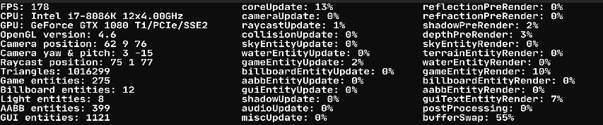

# Appendix
### Coordinate systems
- The **X axis** is horizontal (left & right).
- The **Y axis** is vertical (down & up).
- The **Z axis** is what makes a 3D world (back & front).
- The **3D coordinate system** works on decimals with **XYZ(0.0, 0.0, 0.0)** as **center** coordinate. They can go in **any** direction (positive & negative).
- The **2D coordinate system** works on decimals with **XY(0.0, 0.0)** as **center** coordinate. The range is between **-1.0 and 1.0** from left to right & bottom to top.
### Rotations
- Beware of the **[Gimbal lock](https://en.wikipedia.org/wiki/Gimbal_lock)** when **rotating** objects in all 3 (XYZ) directions!
- Rotations of **models** & **billboards** are **Y-based**. This means that X & Z rotations are **relative** to the Y rotation, which is very useful in a lot of gameplay situations.
- All rotational **degrees** cannot be higher than 360 or lower than -360 (example: 500 degrees will be 140 degrees).
- X rotations go **towards** the direction of the X axis.
- Z rotations go **towards** the direction of the Z axis.
- Y rotations go **around** the direction of the Y axis.
- FabiEngine3D does **not** support a camera roll, because of the infamous Gimbal Lock.
- FabiEngine3D **does** come with first person camera support, but **not** third person.
### AABB system
- Bound **model AABBs** are adjusted to the transformation (position, rotation, size) of the model **automatically**. They will only rotate in **1 direction** (the direction with the greatest angle of rotation).
- Bound **billboard AABBs** are adjusted to the transformation (position, rotation, size) of the billboard **automatically**. They will rotate only in **1 direction** (the direction with the greatest angle of rotation).
- **"Rotated"** AABBs will be translated and/or scaled in **90 degrees** directions (0, 90, 180, 270, etc).
- If you want to access an individual **AABB** bound to a **model**, the ID is composed like this: **modelID + "@" + aabbName**.
- If you want to access an individual **AABB** bound to a **bilboard**, the ID is composed like this: **billboardID + "@" + aabbName**.
### Value limits for frequently used values
- **Color** values (r,g,b) are clamped between 0.0 and 1.0 (0% and 100% respectively).
- **Alpha/transparency** values are clamped between 0.0 and 1.0 (0% and 100% respectively).
- **Mix** values are clamped between 0.0 and 1.0 (0% and 100% respectively).
- **Volume** values are clamped between 0.0 and 1.0 (0% and 100% respectively).
- **Size/width/height** values cannot be lower than 0.0 (a size of 0.0 means that nothing exists).
- **Lightness/intensity/brightness** values cannot be lower than 0.0 (there cannot be less light than complete darkness).
- **Distance** values are absolute (cannot be lower than 0.0).
- **UV repeat** values cannot be lower than 0 (something cannot repeat negatively).
- **Factor** values cannot be lower than 0.0 (you cannot take the power of a negative value).
- **Index** values cannot be lower than 0 (because a negative index does not exist).
- **Rotation angle** values cannot be higher than 360 or lower than -360 (example: 500 degrees will be 140 degrees).
### Miscellaneous
- **Billboards** are **NOT** affected by any lighting or shadows. They are only affected by DOF, fog, motion blur, lens flare.
- **Text** entities are rendered on top of **image** entities, because of the **rendering order**.
- **Centering** the **cursor** might take 1 frame (or more) in **time**, because it will **NOT** be centered instantly.
### Tips & tricks
- You can create your own custom **subfolders** within the main folder of `user\assets`.
- Internal engine updates happen **after** the scripting updates.
- The top viewport has a button called "**uncache**" which forces the engine to load an asset again, even if it was cached.
- You can **clear** the console output by pressing **C** when hovering the **console window**.
### Known issues
- There is a VERY rare **bug** when using the first person camera system; if the cursor does not center anymore and the camera keeps spinning very fast, click on the **window border** once. This bug does not occur in fullscreen mode.
- If FabiEngine3D crashes with the error `"WASAPI can't find requested audio endpoint: Element not found."`, then you do not have an active audio device enablde or you have sound driver problems.
### Performance

- You can use the performance statistics to analyze your **game's performance**.
- The amounts of entities are the **total** amounts.
- The amount of triangles is the **realtime** amount of triangles being rendered every frame.
- `coreUpdate` includes all function calls and calculations in your **update scripts**.
- `bufferSwap` means the actual buffering on the **output screen**.
- Make use of **LOD models** to improve your performance on **high-poly models**.
- **Lower the graphics quality** in the project settings to improve your **graphics performance**.
- The water refraction effect has a **huge** impact on performance, because all models & billboards have to be rendered **twice**.
- The in-engine logging console **can** have impact on performance during in-engine gameplay runtime, because of scripting **error checks**. The higher the **amount** of console messages, the **bigger** the performance impact. To resolve this, simply **clear** the console messages.
