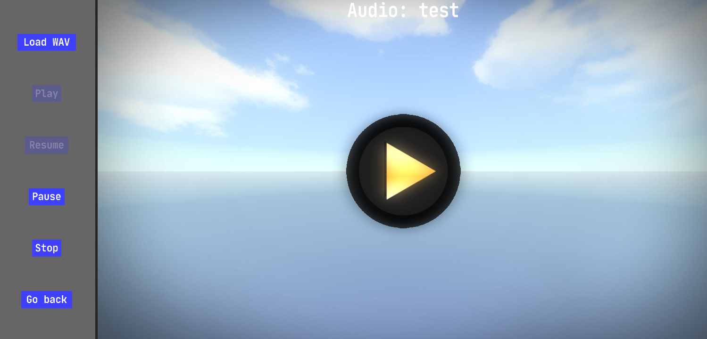

# Audio Editor

- You can **create/edit/delete** audio that can be placed in a scene or **placed/played** with scripting.
- Every created audio can be placed in a **scene** later on.
- **Audio data**: `WAV` format audio file from `game_assets\audio`.
- Audio can be played in **2D**.
- Audio can be played in **3D** (position, max distance, max volume).
- 3D audio has **stereo panning**.
- Audio can be added to the **music playlist**.
