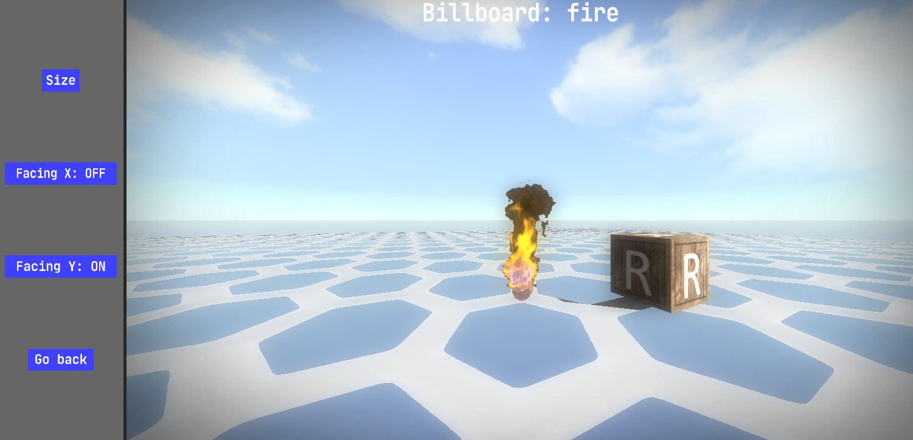

# Billboard Editor

### General
- All billboard will be saved in `projects\<your_project>\data\billboard.fe3d`.
- You can **create/edit/delete** billboards.
- Every created billboard can be placed in a **scene** later on.
- Every billboard has its own flat **AABB** based on their size.
- You can toggle the **reference box** with the `R` key.
- You can toggle **debug rendering** with the `H` key.
- You can **rotate the camera** with the mouse scroll wheel.
### Text
- A text billboard consists of custom (colored) text using a custom loaded **font**.
- **Font**: `TTF` format font file from `game_assets\fonts`.
### Texturing
- **Texture**: colored 24bit/32bit `PNG` format image file from `game_assets\textures\billboard_maps`
- A non-text billboard can have a **texture** and/or custom **color**.
- A textured billboard can have a **sprite animation**.
### Properties
- **Size**: the size of the billboard. **Range**: 0 to inf.
- **Rows**: the amount of rows in the sprite animation texture. **Range**: 1 to inf.
- **Columns**: the amount of columns in the sprite animation texture. **Range**: 1 to inf.
- **Frame step**: the amount of engine frames between the sprite animation frame cycles. **Range**: 0 to inf.
- **Alpha**: enable or disable transparent pixels removal from the texture. **Range**: ON or OFF.
- **Facing X**: enable or disable billboard facing towards the camera around the X axis. **Range**: ON or OFF.
- **Facing Y**: enable or disable billboard facing towards the camera around the Y axis. **Range**: ON or OFF.
- **Lightness**: the brightness of the billboard fragments. **Range**: 0 to inf.
- **Color**: the RGB color that will be mixed with the billboard fragments. **Range**: 0 to 255.
- **Content**: the text content of the billboard.
