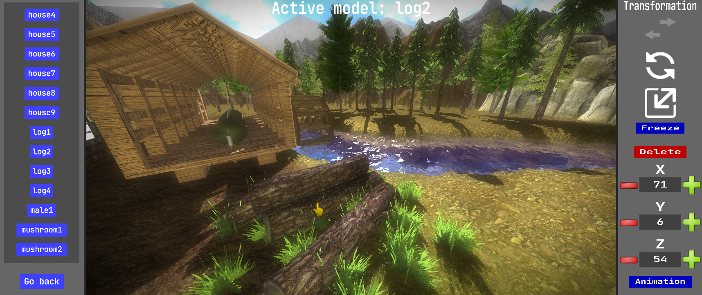

# Scene Editor

### General
- All scenes will be saved in `projects\<your_project>\scenes\editor\`.
- **Everything** that you **place** in a scene (environment, model, billboard, sound, light) is **connected** to the **editors**. Only the things you change in the scene editor will be saved into the scene. For example: if you have a scene full of **green trees** and you change the color of that model to **red** in the **model editor**, those trees in the scene will become **red as well**.
- Use the `WASD` keys to move around.
- Use the `SPACE` key to move **up**.
- Use the `LSHIFT` key to move **down**.
- Hold `RMB` and move the mouse to look around.
- Click on a placed model to select it (if it has a correct AABB).
- You can toggle **debug rendering** with the `H` key.
- You can toggle **wireframe rendering** with the `F` key.
- You can toggle **AABB rendering** with the `B` key.
### Environment
- Sky: you can select **only 1** sky, created in the environment editor.
- Terrain: you can select **only 1** terrain, created in the environment editor.
- Water: you can select **only 1** water, created in the environment editor.
### Models
- You can **place and delete** models in the scene.
- If a terrain is selected, the model will be placed **on top** of the terrain.
- If no terrain is selected, the model will be placed at **XYZ(0,0,0)**.
- Every placed model has a **position** (**Range**: -inf to inf) that can be **edited**.
- Every placed model has a **rotation** (**Range**: -360 to 360) that can be **edited**.
- Every placed model has a **size** (**Range**: 0 to inf) that can be **edited**.
- You can attach an (endless) **animation** to a placed model.
- You can **"freeze"** into local space rendering, which means its position is not affected by camera movement.
### Billboards
- You can **place and delete** billboards in the scene.
- If a terrain is selected, the billboard will be placed **on top** of the terrain.
- If no terrain is selected, the billboard will be placed at **XYZ(0,0,0)**.
- Every placed billboard has a **position** (**Range**: -inf to inf) that can be **edited**.
- Every placed billboard has a **rotation** (**Range**: -360 to 360) that can be **edited**.
- Every placed billboard has a **size** (**Range**: 0 to inf) that can be **edited**.
### Sound
- You can **place and delete** 3D sound casters in the scene.
- If a terrain is selected, the sound caster will be placed **on top** of the terrain.
- If no terrain is selected, the sound caster will be placed at **XYZ(0,0,0)**.
- Every placed sound caster has a **position** (**Range**: -inf to inf) that can be **edited**.
- Every placed sound caster has a **maximum volume** (**Range**: 0 to 100) that can be **edited**.
- Every placed sound caster has a **maximum distance** (**Range**: 0 to inf) that can be **edited**.
### Lighting
- You can enable **ambient lighting** which has a **color** (**Range**: 0 to 255) & **intensity** (**Range**: 0 to inf).
- You can enable **directional lighting** which has a **color** (**Range**: 0 to 255) & **intensity** (**Range**: 0 to inf) & **position** (**Range**: -inf to inf).
- Directional lighting has the option to show a **light source billboard**, which has a **size** (**Range**: 0 to inf).
- You can **place and delete** point lights in the scene.
- If a terrain is selected, the point light will be placed **on top** of the terrain.
- If no terrain is selected, the point light will be placed at **XYZ(0,0,0)**.
- Every placed point light has a **position** (**Range**: -inf to inf) that can be **edited**.
- Every placed point light has a **maximum distance** (**Range**: 0 to inf) that can be **edited**.
- Every placed point light has an **intensity** (**Range**: 0 to inf) that can be **edited**.
- Every placed point light has a **color** (**Range**: 0 to 255) that can be **edited**.
### Settings
- You can change the editor **camera** movement speed (**Range**: 0 to inf).
- You can set the **minimum distance** by which **level of detailed models** will change their rendering (**Range**: 0 to inf).
### Settings - Graphics - Shadows
- You can enable **directional shadows** casted from a certain **position** (**Range**: -inf to inf).
- Shadows are rendered within boxed borders with a certain **size** (**Range**: 0 to inf).
- You can determine the direction of the shadows by setting the **center position** (**Range**: -inf to inf).
- There is an option to make the shadow box **follow the camera** at a certain **interval** (**Range**: 0 to inf) measured in frames.
- Additionally you can choose to enable **soft shadows** and andjust the **lightness** (**Range**: 0 to inf) of the shadows.
### Settings - Graphics - Motion blur
- You can enable **motion blur** with a custom **strength** (**Range**: 0 to inf).
### Settings - Graphics - Depth Of Field
- You can enable dynamic **Depth Of Field** or enable a static **distant blur**.
- The distance to objects for dynamic DOF can be adjusted with the **DOF distance** (**Range**: 0 to inf) property.
- You can change he distance from which the blur starts with the **blur distance** (**Range**: 0 to inf) property.
### Settings - Graphics - Fog
- You can enable **fog** based on a **minimum distance** (**Range**: 0 to inf) & **maximum distance** (**Range**: 0 to inf).
- Additionally you can set the **fog intensity** (**Range**: 0 to inf) & **fog color** (**Range**: 0 to 255).
### Settings - Graphics - Lens Flare
- You can enable a **lens flare** for directional lighting based on a **flare map texture**.
- The brightness of the flare can be adjusted with the **intensity** (**Range**: 0 to inf) property.
- You can change how fast the flare fades with the **multiplier** (**Range**: 0 to inf) property).
- **Flare map**: colored 24bit `PNG` format image file from `game_assets\textures\flare_maps`.
### Settings - Graphics - Dynamic sky HDR
- You can enable **dynamic sky HDR** based on extra **intensity** (**Range**: 0 to inf) that is added to the sky rendering.
