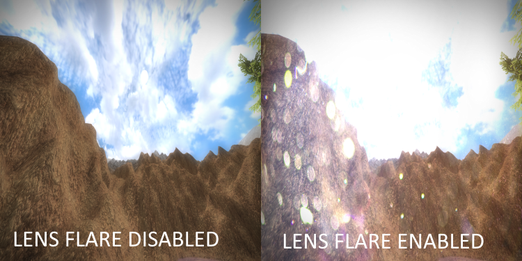

# Theoretical Framework
- **Collision**: intersection between 2 things (for example: between the camera and a model).
- **Raycasting**: the process of "shooting" a ray from the camera position towards where the camera is looking.
- **Model**: a complex 3D object in 3D space, constisting of a mesh.  

- **Billboard**: a 2D quad in 3D space.  

- **AABB**: Axis Aligned Bounding Box, a 3D box used for collision.  

- **LOD model**: Level Of Detail model, a less-detailed version of a model.  

### Graphical Effects
- **Ambient lighting**: the overall lightness of a scene.  

- **Directional lighting**: diffuse lighting based on a directional light source (for example: the sun).  

- **Point lighting**: individual light casters that show light around them (for example: a torch).  

- **Spot lighting**: a spot light casted from the camera position towards where the camera is looking (for example: a flashlight).  

- **Specular lighting**: specular lighting is a light reflection from any light caster.  

- **DOF**: Depth Of Field, a post-processing effect that blurs all non-focused pixels.  

- **Fog**: the whole scene can have a foggy effect.  

- **Shadows**: models can be shadowed for a more realistic scene.  

- **Motion blur**: pixels will be blurred in the first person camera direction of motion.  

- **Lens flare**: a post-processing flare overlay will be shown when the camera is looking at the directional lighting position (for example: the sun).  

- **Sky HDR**: an effect that effects the brightness of the sky based on the camera pitch angle.  

### Texturing
- **Diffuse mapping**:
- **Light mapping**:
- **Reflection mapping**:
- **Normal mapping**:
- **Height mapping**:
- **Blend mapping**:
- **DUDV mapping**:
- **Displacement mapping**:
