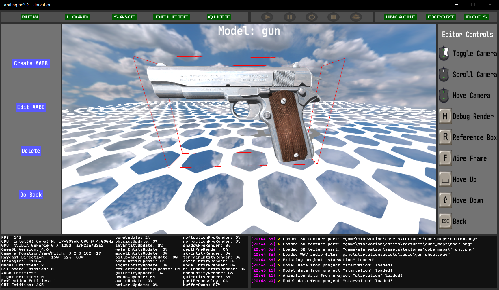

## Introduction

FabiEngine3D is a game engine, created for simple 3D video games on PC. It contains various features such as: multithreaded asset loading, 2D & 3D rendering, keyboard & mouse input, 3D physics, 2D & 3D audio, networking, custom scripting and an engine GUI to work with. The engine only uses 2 libraries: OpenGL 4.6 & SDL 2. It is written in C++20 and works only on Microsoft Windows. Why is it called FabiEngine you might ask? I named my game engine after my lovely wife Fabienne!

`Development started on April 7, 2020.`

## Games

### Starvation

A singleplayer medieval first person survival game in which you have only 1 enemy: death! There are multiple survival factors that you need to watch out for, such as: hunger, thirst, body temperature, oxygen and sickness. You will have to figure out on your own how to surive the longest using tools, resources, animals and buildings, before the Grim Reaper comes for your soul...

### White Noise

A multiplayer first person shooter game based in a science-fiction setting: a space station! You can join a server with up to 3 other friends to see who is the best at shooting each other. Watch out, because 1 bullet is enough to make the endless void of space your final resting place!

## Documentation

### Basics

- [Theoretical Framework](doc/THEORETICAL_FRAMEWORK.md)
- [General Information](doc/GENERAL_INFORMATION.md)
- [Assets](doc/ASSETS.md)
- [Entities](doc/ENTITIES.md)
- [Camera](doc/CAMERA.md)
- [Graphics](doc/GRAPHICS.md)

### Editors

- [Sky Editor](doc/SKY_EDITOR.md)
- [Terrain Editor](doc/TERRAIN_EDITOR.md)
- [Water Editor](doc/WATER_EDITOR.md)
- [Model Editor](doc/MODEL_EDITOR.md)
- [Animation Editor](doc/ANIMATION_EDITOR.md)
- [Billboard Editor](doc/BILLBOARD_EDITOR.md)
- [Audio Editor](doc/AUDIO_EDITOR.md)
- [Scene Editor](doc/SCENE_EDITOR.md)
- [Script Editor](doc/SCRIPT_EDITOR.md)
- [Settings Editor](doc/SETTINGS_EDITOR.md)

### Scripting

- [FabScript](doc/FABSCRIPT.md)
- [Engine Functions](doc/SCRIPT_FE3D.md)
- [Mathematical Functions](doc/SCRIPT_MATH.md)
- [Miscellaneous Functions](doc/SCRIPT_MISC.md)

### Miscellaneous

- [Networking](doc/NETWORKING.md)
- [Runtime](doc/RUNTIME.md)
- [Miscellaneous](doc/MISCELLANEOUS.md)
