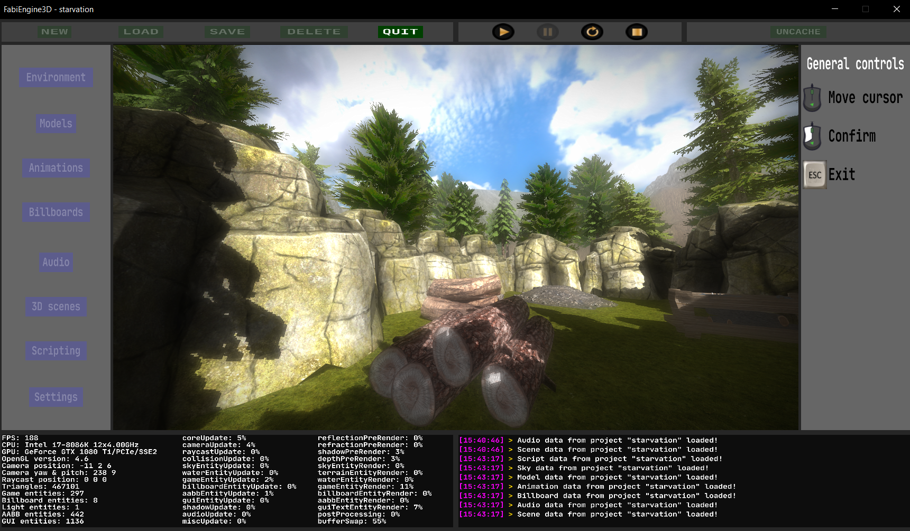

# FabiEngine3D
FabiEngine3D is a small game engine for simple 3D games.  
It contains various features such as: asset loading, 2D & 3D rendering, audio, user input, physics, scripting and an engine GUI to work with.  
The engine only uses 2 libraries: OpenGL 4.5 & SDL2. It is written in C++17 and works only on Windows.

# Table of contents
1. [Features](#features)
2. [Engine Interface](#engine-interface)
3. [Folder Structures](#folder-structures)
4. [Development Order](#development-order)
5. [Project Management](#project-management)
6. [Environment Editor](#environment-editor)
7. [Model Editor](#model-editor)
8. [Animation Editor](#animation-editor)
9. [Billboard Editor](#billboard-editor)
10. [Audio Editor](#audio-editor)
11. [Scene Editor](#scene-editor)
12. [Script Editor](#script-editor)
13. [Project Settings](#project-settings)
14. [FabScript](#fabscript)
15. [Function List](#function-list)
16. [Game Execution](#game-execution)
17. [Game Exporting](#game-exporting)
18. [Appendix](#appendix)
19. [Screenshots](#screenshots)

# Features
### Asset Loading
- Multithreaded PNG texture file loading
- Multithreaded OBJ mesh file loading
- Multithreaded WAV audio file loading
- Efficient (pre-)caching system  
### Rendering
- **3D rendering**: sky, terrain, water, model, billboard
- **2D rendering**: image, text
- **Graphics**: ambient lighting, directional lighting, specular reflections, point lights, shadows, sky reflections, realtime scene reflections, fog
- **Textures**: diffuse, cube, normal, reflection, light, height, gui, flare, dudv, displacement, blend, billboard
- **Post processing**: bloom, DOF, motion blur, anti aliasing, sky HDR, lens flare
### Audio
- Custom music playlist
- 2D audio playback
- 3D audio playback (volume distance, stereo panning)
### Physics
- AABB system
- Collision detection
- Collision response
- Raycasting system
- 3D camera system
- Custom math library
### Miscellaneous
- Keyboard input
- Mouse input
- Controller input
- Custom "FabScript" functional interpreted gameplay programming language.

# Engine Interface

The engine GUI is divided into 5 sections:
- Left viewport: editor menus and project settings
- Top viewport: project management & game preview management
- Right viewport: controls & scene editor properties
- Bottom viewport: statistics & logging console
- Mid viewport: 3D display screen

# Folder Structures
The engine root directory holds 6 folders and 1 file:
- `binaries\`: this folder holds the **.exe** file and all corresponding DLLs (do **NOT** touch).
- `engine_assets\`: this folder holds all **engine resources** such as libraries & shaders (do **NOT** touch).
- `game_assets\`: this folder is where all your **game assets** are stored. It also holds the project files.
- `libraries\`: this folder holds the **.exe** file and all corresponding DLLs (do **NOT** touch).
- `projects\`: this folder holds the **.exe** file and all corresponding DLLs (do **NOT** touch).
- `shaders\`: this folder holds the **.exe** file and all corresponding DLLs (do **NOT** touch).
- `config.fe3d`: test

# Development Order
- **Project management**
  > In the top-viewport you can create, edit, save and delete projects. 1 project = 1 game.
- **Environment editor**
  > This is where you can create environment entities. There are 3 types of environments: sky, terrain, water.
- **Model editor**
  > This is where you can create model entities composed of a mesh, textures, AABBs and other properties.
- **Animation editor**
  > This is where you can create custom animations using keyframe. Types of animation: translation, rotation, scaling.
- **Billboard editor**
  > This is where you can create billboard entities composed of texture/color/text and other properties.
- **Audio editor**
  > This is where you can create audio entities composed of an audio file.
- **Scene editor**
  > This is where you bring all the created environment, models, animations, billboards and audio together into a scene.
- **Script editor**
  > This is where you define your game logic. There are 3 types of logic: initialization, update, destruction.
- **Project settings**
  > This is where you can setup mostly graphical properties of your game such as shadow quality, reflection quality, etc.

# Project Management
- You can **create/edit/save/delete** a project.
- Every **project** is a different **game** and must have a **unique** name.
- A project has its own folder in the engine `user\projects\` directory.
- An important note is to **NOT** change anything in this directory!
- The only directory that you can change is the `game_assets\`folder.

# Project Settings
- MSAA quality (default: 4).
- Shadow quality (default: 2048).
- Reflection quality (default: 256).
- Refraction quality (default: 256).
- Max audio channels (default: 128).
