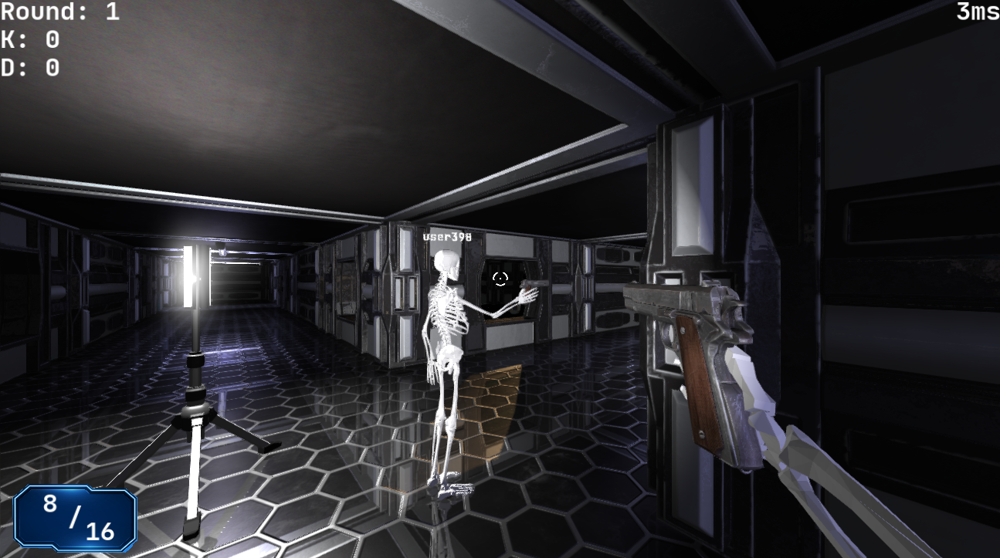

## Introduction

FabiEngine3D is a game engine, created for simple 3D video games on PC. It contains various features such as: multithreaded asset management, 2D/3D rendering, mouse/keyboard input, 3D physics, 2D/3D audio, networking, custom scripting and an engine GUI to work with. The engine only uses one external library which is OpenGL (GLSL). FabiEngine3D is written in C++ and works only on Microsoft Windows. Why is it called FabiEngine you might ask? I named my game engine after my lovely wife Fabienne!

`Development started on April 7, 2020.`

## Games

### Starvation

Starvation is a singleplayer medieval first person survival game in which you have only one enemy: death! There are multiple survival factors that you need to watch out for, such as: hunger, thirst, body temperature, oxygen and sickness. You will have to figure out on your own how to surive the longest using tools, resources, animals and buildings, before the Grim Reaper comes for your soul...

### White Noise

White Noise is a multiplayer first person shooter game based in a science-fiction setting: a space station! You can join a server with up to 3 other friends to see who is the best at shooting each other. Watch out, because one bullet is enough to make the endless void of space your final resting place!

## Documentation

- [General](doc/markdown/GENERAL.md)
- [Assets](doc/markdown/ASSETS.md)
- [Sky](doc/markdown/SKY.md)
- [Terrain](doc/markdown/TERRAIN.md)
- [Water](doc/markdown/WATER.md)
- [Model](doc/markdown/MODEL.md)
- [Quad3D](doc/markdown/QUAD3D.md)
- [Quad2D](doc/markdown/QUAD2D.md)
- [Text3D](doc/markdown/TEXT3D.md)
- [Text2D](doc/markdown/TEXT2D.md)
- [Animation3D](doc/markdown/ANIMATION3D.md)
- [Animation2D](doc/markdown/ANIMATION2D.md)
- [AABB](doc/markdown/AABB.md)
- [Pointlight](doc/markdown/POINTLIGHT.md)
- [Spotlight](doc/markdown/SPOTLIGHT.md)
- [Captor](doc/markdown/CAPTOR.md)
- [Sound3D](doc/markdown/SOUND3D.md)
- [Sound2D](doc/markdown/SOUND2D.md)
- [Graphics](doc/markdown/GRAPHICS.md)
- [Camera](doc/markdown/CAMERA.md)
- [Physics](doc/markdown/PHYSICS.md)
- [Networking](doc/markdown/NETWORKING.md)
- [Scripting](doc/markdown/SCRIPTING.md)
- [Editors](doc/markdown/EDITORS.md)
- [Runtime](doc/markdown/RUNTIME.md)
- [Performance](doc/markdown/PERFORMANCE.md)
- [Miscellaneous](doc/markdown/MISCELLANEOUS.md)
