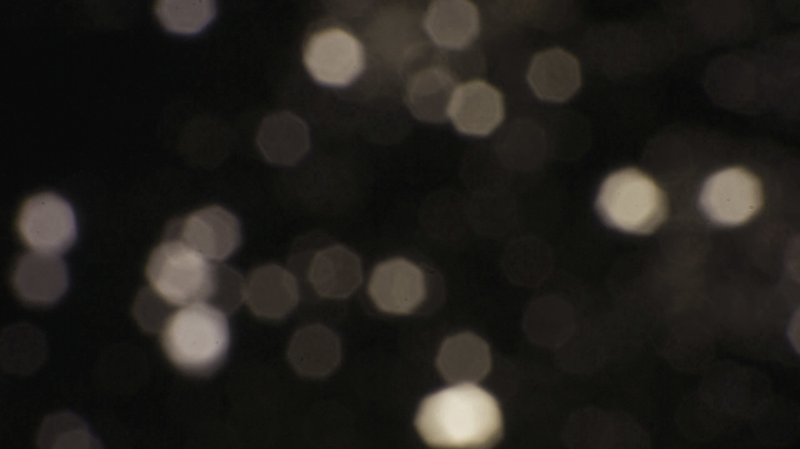

# Assets

## 1. Audio

- Audio assets must be placed in `~\projects\<your_project>\assets\audio\`.
- The [file format](https://en.wikipedia.org/wiki/WAV) is `.wav` because the absence of compression delivers high audio quality.
- Due to the uncompressed format, note that the files can be very big.

## 2. Font

- Font assets must be placed in `~\projects\<your_project>\assets\fonts\`.
- The [file format](https://en.wikipedia.org/wiki/TrueType) is `.ttf` because it is the most used and common format for text fonts.
- Fonts are used to process text content into a texture.

## 3. Mesh

- Mesh assets must be placed in `~\projects\<your_project>\assets\meshes\`.
- The [file format](https://en.wikipedia.org/wiki/Wavefront_.obj_file) is `.obj` because it is easy, lightweight and commonly used.
- Meshes are used to render complex 3D objects on the screen.
- Make sure that the mesh file contains: `v`, `vt`, `vn`, `f`.
- Make sure that the center of your mesh is XYZ(0,0,0).
- The mesh should be modeled so that the lowest vertex (Y coordinate) is positioned at the center.
- A mesh can consist of multiple parts.
- To make a mesh multiparted, you must specify at least 2 parts by writing `FE3D_PART <name>`.
- Example multiparted `.obj` file:

  ```obj
  FE3D_PART part1
  v ...
  vt ...
  vn ...
  f ...
  FE3D_PART part2
  v ...
  vt ...
  vn ...
  f ...
  ```

## 4. Texture

- Texture assets must be placed in `~\projects\<your_project>\assets\textures\`.
- The [file format](https://en.wikipedia.org/wiki/Portable_Network_Graphics) is `.png` because the absence of compression delivers high image quality.
- Due to the uncompressed format, note that the files can be very big.
- Textures are used for a variety of reasons for rendering.

### 4.1 Blend Map


- Blend map assets must be placed in `~\projects\<your_project>\assets\textures\blend_maps\`.
- Bit depth: `24`
- Blend maps are used to render and mix multiple textures onto a terrain mesh.
- Each pixel (R,G,B) of the blend map corresponds to a different diffuse/normal map.
- In total you can use up to 10 different textures:
  - 1x height map
  - 1x blend map
  - 1x base diffuse map
  - 1x base normal map
  - 3x blend diffuse map
  - 3x blend normal map

### 4.2 Cube Map


- Cube map assets must be placed in `~\projects\<your_project>\assets\textures\cube_maps\`
- Bit depth: `8`
- Cube maps are used to render a [skybox](https://en.wikipedia.org/wiki/Skybox_(video_games)) around the camera.
- A cube map consists of 6 images: left, right, bottom, top, back, front.

### 4.3 Diffuse Map


- Diffuse map assets must be placed in `~\projects\<your_project>\assets\textures\diffuse_maps\`
- Bit depth: `24/32`
- Diffuse maps are used to render a variety of colors to a mesh.

### 4.4 Displacement Map


- Displacement map assets must be placed in `~\projects\<your_project>\assets\textures\displacement_maps\`
- Bit depth: `24`
- DUDV maps are used to create waves in a water mesh.

### 4.5 DUDV Map


- DUDV map assets must be placed in `~\projects\<your_project>\assets\textures\dudv_maps\`
- Bit depth: `24`
- Displacement maps are used to create ripples in a water texture.

### 4.6 Emission Map


- Emission map assets must be placed in `~\projects\<your_project>\assets\textures\emission_maps\`
- Bit depth: `24`
- Emission maps are used to make certain parts of a mesh emit more light.

### 4.7 Flare Map



- Flare map assets must be placed in `~\projects\<your_project>\assets\textures\flare_maps\`
- Bit depth: `24`
- Flare maps are used in the [lens flare effect](GRAPHICS.md).
- The pixel colors in the flare map are added to the 3D rendering pixels in the post-processing pipeline

### 4.8 Height Map


- Height map assets must be placed in `~\projects\<your_project>\assets\textures\height_maps\`.
- Bit depth: `8`
- Height maps are used to generate a terrain mesh.
- Each pixel of the height map corresponds to a vertex height.

### 4.9 Image Map


- Image map assets must be placed in `~\projects\<your_project>\assets\textures\image_maps\`
- Bit depth: `24/32`
- Image maps are used as a texture for [image entities](ENTITIES.md).

### 4.10 Normal Map


- Normal map assets must be placed in `~\projects\<your_project>\assets\textures\normal_maps\`
- Bit depth: `24`
- Normal maps are used for more detailed lighting effects on a mesh.

### 4.11 Reflection Map


- Reflection map assets must be placed in `~\projects\<your_project>\assets\textures\reflection_maps\`
- Bit depth: `24`
- Reflection maps are used to specify which parts of a mesh are reflective.

### 4.12 Specular Map


- Specular map assets must be placed in `~\projects\<your_project>\assets\textures\specular_maps\`
- Bit depth: `24`
- Specular maps are used to specify which parts of a mesh are [specular](https://en.wikipedia.org/wiki/Specular_highlight).
