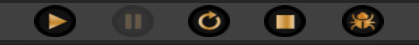

# Application execution

- You can **play/pause/resume/stop/debug** the application preview.
- All **changes** made through scripting will be **reset** when the preview is stopped (unless persisted in a file).
- You can pause the runtime with **ESCAPE**.
- If the application is paused you can start a **debugging** frame which prints a **performance** report about your **script execution**.

# Config file
- The config file can be found at `<your_directory>\config.fe3d`.
- `window_size_multiplier`: decimal value between 0.0 and 1.0; A value of 1.0 means the full monitor resolution.
- `window_fullscreen`: boolean value; toggle window fullscreen.
- `window_borderless`: boolean value; toggle window border visibility.
- `window_title`: string value; title of the application window.
- `application_title`: string value; title of your application.
- `application_exported`: boolean value; set to true if you want to export your application.

# Application exporting
- Create a new **directory** for your application somewhere on your PC.
- Copy `FabiEngine3D\binaries\` to `<your_directory>`.
- Copy `FabiEngine3D\engine_assets\` to `<your_directory>`.
- Unless your application is a **server**, copy `FabiEngine3D\game_assets\` to `<your_directory>` (only the assets you **need**).
- Copy `FabiEngine3D\config.fe3d` to `<your_directory>`.
- Copy **ALL** contents from `FabiEngine3D\projects\<your_project>` to `<your_directory>`.
- In the **config** file, set the `application_exported` option to `true` and change the other options to your liking.
- Rename `<your_directory>\binaries\FabiEngine3D.exe` to your liking.
- Open `<your_directory>\binaries\<your_application>.exe` to start your application!
