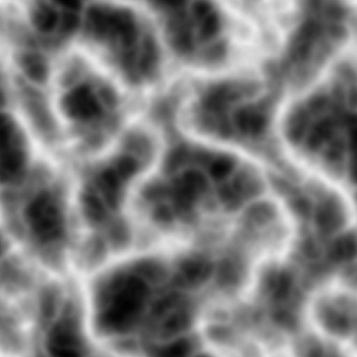
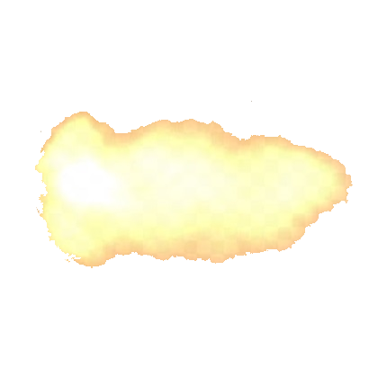
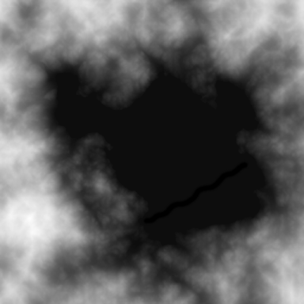

# Assets

## 1. Audio

- Audio files are used to play 2D/3D sounds.
- Audio assets must be placed in `~\projects\<your_project>\assets\audio\`.
- The file format is `.wav` because it delivers high audio quality.

## 3. Mesh

- Mesh files are used to render complex 3D objects.
- Mesh assets must be placed in `~\projects\<your_project>\assets\mesh\`.
- The file format is `.obj` because it is simple and commonly used.
- Every mesh must contain: `v`/`vt`/`vn`/`f`.
- Every mesh must have XYZ(0,0,0) as center.
- Every mesh should be modeled so that the lowest vertex (Y coordinate) is positioned at the center.
- A mesh can consist of multiple parts.
- To make a mesh multiparted, you must specify at least 2 parts by writing `FE3D_PART <name>`.
- The name of a mesh part cannot be "?".
- Example multiparted `.obj` file:

  ```text
  FE3D_PART part1
  v ...
  vt ...
  vn ...
  f ...
  FE3D_PART part2
  v ...
  vt ...
  vn ...
  f ...
  ```

## 4. Image

- Images are used for a variety of reasons for rendering.
- Image assets must be placed in `~\projects\<your_project>\assets\image\`.
- The file format is `.tga` because it delivers high image quality.
- Every image must be exported without RLE compression.
- Every image must be exported with the lower-left corner as the origin.
- Every image must have a resolution of at least 1x1.
- Every image must have a bit depth of 24 or 32.

### 4.1 Blend Map


- Blend map assets must be placed in `~\projects\<your_project>\assets\image\blend_map\`.
- Bit depth: **24**
- Blend maps are used to render and mix multiple textures onto a terrain mesh.
- Each pixel (R,G,B) of the blend map corresponds to a different diffuse/normal map.
- In total you can use up to 10 different images:
  - 1x height map
  - 1x blend map
  - 1x base diffuse map
  - 1x base normal map
  - 3x blend diffuse map
  - 3x blend normal map

### 4.2 Cube Map


- Cube map assets must be placed in `~\projects\<your_project>\assets\image\cube_map\`
- Recommended bit depth: **24**
- Cube maps are used to render a skybox around the camera.
- A cube map consists of 6 images: left, right, bottom, top, back, front.
- All images must have a squared resolution.
- All images must have the same resolution.
- All images must have the same bit depth.

### 4.3 Diffuse Map


- Diffuse map assets must be placed in `~\projects\<your_project>\assets\image\diffuse_map\`
- Recommended bit depth: **24/32**
- Diffuse maps are used to render a variety of colors to a mesh.

### 4.4 Displacement Map



- Displacement map assets must be placed in `~\projects\<your_project>\assets\image\displacement_map\`
- Recommended bit depth: **24**
- Displacement maps are used to create waves in a water mesh.
- RGB pixels are automatically averaged to calculate their intensity.
- The intensity of each pixel corresponds to a vertex height.

### 4.5 DUDV Map


- DUDV map assets must be placed in `~\projects\<your_project>\assets\image\dudv_map\`
- Recommended bit depth: **24**
- DUDV maps are used to create ripples in a water texture.

### 4.6 Emission Map



- Emission map assets must be placed in `~\projects\<your_project>\assets\image\emission_map\`
- Recommended bit depth: **24**
- Emission maps are used to make certain parts of a mesh appear brighter.

### 4.7 Flare Map


- Flare map assets must be placed in `~\projects\<your_project>\assets\image\flare_map\`
- Recommended bit depth: **24**
- Flare maps are used in the [lens flare effect](GRAPHICS.md).
- The pixel colors in the flare map are added to the 3D rendering pixels in the post-processing pipeline

### 4.8 Font Map


- Font map assets must be placed in `~\projects\<your_project>\assets\image\font_map\`
- Recommended bit depth: **32**
- Font maps are used to render text.
- A [font generator](http://www.codehead.co.uk/cbfg/) must be used to create font maps.
- Each font map must have 6 rows and 16 columns.

### 4.9 Height Map



- Height map assets must be placed in `~\projects\<your_project>\assets\image\height_map\`.
- Recommended bit depth: **24**
- A maximum resolution of 1024 pixels is recommended.
- A resolution where the width equals the height is recommended.
- Height maps are used to generate a terrain mesh.
- RGB pixels are automatically averaged to calculate their intensity.
- The intensity of each pixel corresponds to a vertex height.

### 4.10 Normal Map


- Normal map assets must be placed in `~\projects\<your_project>\assets\image\normal_map\`
- Recommended bit depth: **24**
- Normal maps are used for more detailed lighting effects on a mesh.

### 4.11 Reflection Map


- Reflection map assets must be placed in `~\projects\<your_project>\assets\image\reflection_map\`
- Recommended bit depth: **24**
- Reflection maps are used to specify which parts of a mesh are reflective.

### 4.12 Specular Map


- Specular map assets must be placed in `~\projects\<your_project>\assets\image\specular_map\`
- Recommended bit depth: **24**
- Specular maps are used to specify which parts of a mesh are specular lighted.
