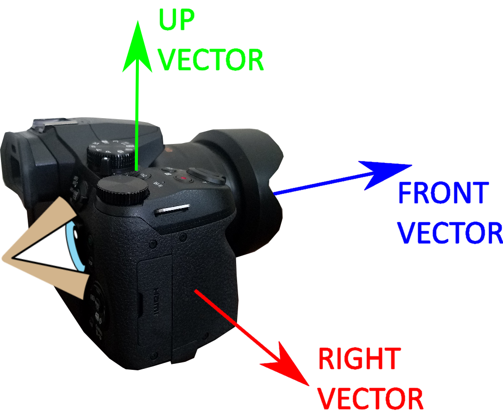

# Camera

## 1. Coordinate system

- The X axis is horizontal (left & right).
- The Y axis is vertical (bottom & top).
- The Z axis is depth (back & front).
- The 3D coordinate system works with decimal values with XYZ(0,0,0) as the center coordinate. The range is infinite in both positive/negative directions.
- The 2D coordinate system works with decimal values with XY(0,0) as the center coordinate. The range is between -1.0 and 1.0.
- The reference box used in FabiEngine3D editors has a size of 1.0.

## 2. Camera angles

- **Pitch**: around the X axis (supported)
- **Yaw**: around the Y axis (supported)
- **Roll**: around the Z axis (unsupported)
- The camera is always looking in a certain direction.
- This direction is defined with 3 camera angles.
- These angles can be manually adjusted.
- FabiEngine3D supports a first person view system.
- FabiEngine3D supports a third person view system.

## 3. Camera Vectors

- When the camera is looking in a certain direction, there are 3 vectors as a result.
- The resulting vectors are normalized.
- These vectors can be used for camera-related transformations.

## 4. Properties

- **Position**: the 3D position of the camera in the world
  - Type: `decimal3`
  - Constraints: none
- **Right**: the normalized vector of the X camera direction
  - Type: `decimal3`
  - Constraints: between `-1.0` and `1.0`
- **Up**: the normalized vector of the Y camera direction
  - Type: `decimal3`
  - Constraints: between `-1.0` and `1.0`
- **Front**: the normalized vector of the Z camera direction
  - Type: `decimal3`
  - Constraints: between `-1.0` and `1.0`
- **FOV**: the visible field of view angle
  - Type: `decimal`
  - Constraints: between `0.0` and `150.0`
- **Near**: the minimum visible distance
  - Type: `decimal`
  - Constraints: at least `0.0`
- **Far**: the maximum visible distance
  - Type: `decimal`
  - Constraints: at least `0.0`
- **Yaw**: the horizontal rotation of the camera direction
  - Type: `decimal`
  - Constraints: between `0.0` and `360.0`
- **Pitch**: the vertical rotation of the camera direction
  - Type: `decimal`
  - Constraints: between `-90.0` and `90.0`
- **First Person Yaw**: the current yaw of the first person view
  - Type: `decimal`
  - Constraints: between `0.0` and `360.0`
- **First Person Pitch**: the current pitch of the first person view
  - Type: `decimal`
  - Constraints: between `-90.0` and `90.0`
- **Min First Person Pitch**: the minimum pitch of the first person view
  - Type: `decimal`
  - Constraints: between `-90.0` and `90.0`
- **Max First Person Pitch**: the maximum pitch of the first person view
  - Type: `decimal`
  - Constraints: between `-90.0` and `90.0`
- **Third Person Yaw**: the current yaw of the third view camera
  - Type: `decimal`
  - Constraints: between `0.0` and `360.0`
- **Third Person Pitch**: the current pitch of the third person view
  - Type: `decimal`
  - Constraints: between `-90.0` and `90.0`
- **Min Third Person Pitch**: the minimum pitch of the third person view
  - Type: `decimal`
  - Constraints: between `-90.0` and `90.0`
- **Max Third Person Pitch**: the maximum pitch of the third person view
  - Type: `decimal`
  - Constraints: between `-90.0` and `90.0`
- **Third Person Distance**: the distance from the camera to the third person lookat
  - Type: `decimal`
  - Constraints: at least `0.01`
- **Third Person Lookat**: the position where the third person view is looking at
  - Type: `decimal`
  - Constraints: none
- **Cursor Sensitivity**: the speed with which the cursor moves the first/third person view
  - Type: `decimal`
  - Constraints: at least `0.0`
- **Acceleration Resistence**: the resistence of the first/third person view acceleration speed
  - Type: `decimal`
  - Constraints: between `0.0` and `1.0`
- **First Person Enabled**: first person view is enabled
  - Type: `boolean`
  - Constraints: none
- **Third Person Enabled**: third person view is enabled
  - Type: `boolean`
  - Constraints: none
