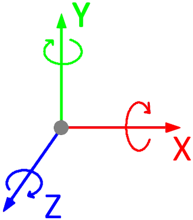

# Miscellaneous

## 1. Rotation system

- X rotations go around the X axis.
- Y rotations go around the Y axis.
- Z rotations go around the Z axis.
- All rotational values are in degrees, not radians.
- Rotational degrees are automatically converted between 0&deg; and 360&deg; (example: 500&deg; = 140&deg;, -500&deg; = 220&deg;).
- **WARNING**: Rotating objects in every direction (XYZ) at the same time can cause the infamous gimbal lock!

## 2. Tips & tricks

- You can create your own custom subfolders within the subfolders of `~\projects\<your_project>\assets\`.
- The top viewport has a button called `UNCACHE` which deletes the chosen asset from the cache (if it was cached).
- The top viewport has a button called `DOCS` that redirects you instantly to the FabiEngine3D documentation.
- You can clear the logging console in the bottom viewport by pressing `C` while hovering over the logging console.
- You can cancel any form by pressing `ESC`.
- You can enter a value form by pressing `ENTER`.

## 3. Miscellaneous

- All quad2D/text2D entities are rendered on top of each other.
- Centering the cursor might take 1 frame (or more) in time, because it might not be centered instantly by Microsoft Windows.
- The engine updates all logic at a fixed speed (144 updates per second), even if the FPS is higher/lower.
- The maximum amount of messages in the engine logging console is 1000.
- Transparency in 2D space is based on the order of placed entities.
- Transparency in 3D space is very complex and can sometimes be incorrect.
- Graphical effects that are set to low quality can flicker.
- Internal engine updates happen after the scripting updates.
