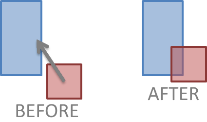
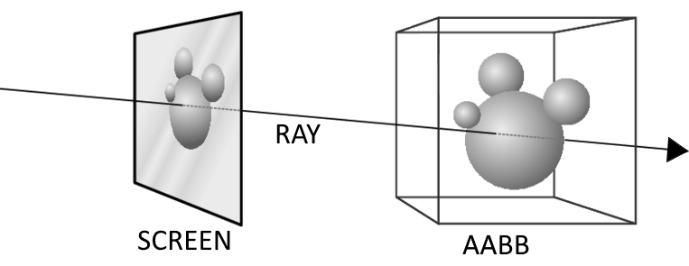

# Physics

## 1. Collision

## 1.1 AABB Entity vs AABB Entity

- FabiEngine3D supports collision (only detection) between 2 AABB entities.
- Collision response can be scripted.

## 1.2 Camera vs AABB entities

- FabiEngine3D supports collision (detection + response) between the camera and multiple AABB entities.
- The camera has its own custom bounding box.

## 1.3 Camera vs Terrain Entity

- FabiEngine3D supports collision (detection + response) between the camera and the terrain entity.
- The camera has a custom minimum distance to the camera.

## 2. Raycasting

## 2.1 Cursor Ray

- The cursor ray is a normalized ray from the cursor to 3D space.
- The position of the ray is simply the camera position.
- The direction of the ray is simply to where the cursor is pointing at.
- Every engine update the cursor ray is calculated.

## 2.1 Terrain Entity Intersection

- FabiEngine3D supports cursor intersection with the terrain entity.
- Used in the mouse picking system of the world editor.
- Can be used for determining the distance from the camera to the terrain entity.
- Terrain entity pointing can be configured for performance.

## 2.2 AABB Entity Intersection

- FabiEngine3D supports cursor intersection with AABB entities.
- Used in the entity selection system of the world editor.
- Can be used to check if the camera is looking at a certain AABB entity.
- Can be used for determining the distance from the camera to a certain AABB entity.
- If terrain entity intersection is enabled, the terrain entity can block AABB intersection.
